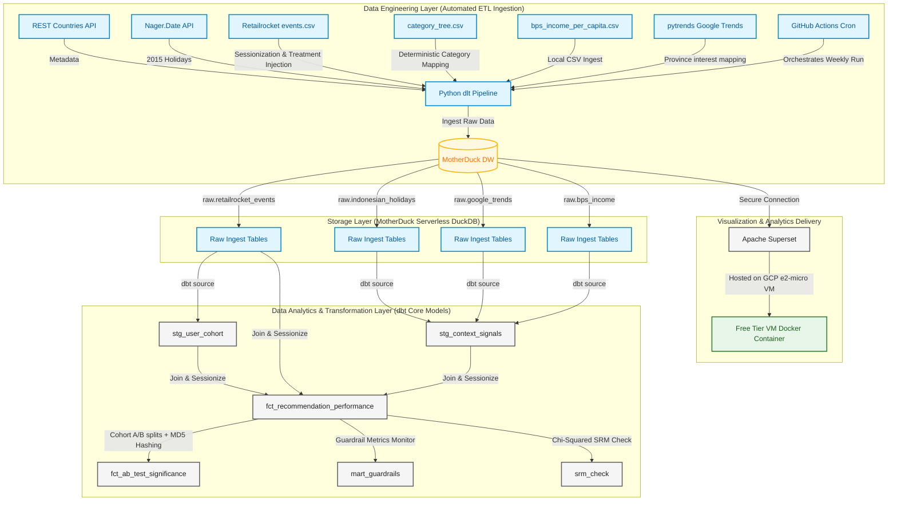

# 🛒 Indonesian Recommendation Friction Lab (v2.0)

An end-to-end automated A/B testing pipeline designed to measure the causal impact of context-aware (Geographical + Cultural) recommendations on user conversion in the Indonesian e-commerce market, using real behavioral events from the **Retailrocket dataset**.

## 🎯 Project Overview
This project evaluates the business impact of an Indonesian context-aware recommendation engine. It runs a randomized control trial to test the hypothesis: **"Does injecting local Indonesian context (holidays, provincial income indices, Google search trends) into product recommendations reduce purchase friction and increase Conversion Rate?"**

This repository serves as a portfolio piece demonstrating:
* **DE Skills:** Automated multi-source ELT pipelines, incremental loading, and API failover resiliency.
* **DA Skills:** Pre-experiment statistical power analysis, Chi-Squared Sample Ratio Mismatch (SRM) checks, Welch's T-Test and Z-Test cohort modeling, and business health guardrail monitoring.

---

## 🏗️ Architecture & Data Flow
The pipeline is designed to be fully automated, resilient, and serverless:



1.  **Ingestion:** Python `dlt` pipeline pulls data from REST Countries API, Nager.Date API, Google Trends (`pytrends`), BPS provincial income data, and the raw Retailrocket behavioral dataset.
2.  **Orchestration:** GitHub Actions triggers the pipeline weekly with timeout limits to prevent quota drain.
3.  **Storage:** MotherDuck (Serverless DuckDB) handles the data warehouse.
4.  **Transformation:** `dbt Core` models clean the data, assign user cohorts using deterministic MD5 hashing, consolidate daily context signals, and compute statistical significance (Welch's T-test and Z-test) directly in SQL.
5.  **Visualization:** Apache Superset (hosted on GCP e2-micro VM) connects securely to MotherDuck to display conversion rates and time-to-purchase lifts.

---

## 🛠️ Tech Stack
| Layer | Technology |
| :--- | :--- |
| **Compute/Cloud** | GCP (e2-micro Always Free) |
| **Orchestration** | GitHub Actions |
| **Ingestion** | Python (`dlt`) |
| **Data Warehouse** | MotherDuck |
| **Transformation** | `dbt Core` |
| **Visualization** | Apache Superset (Dockerized on VM) |

---

## 📊 A/B Testing & Statistical Framework
The experiment uses a randomized control trial split:
* **Control Group:** Popularity-based ranking (global purchase frequency in the past 30 days).
* **Treatment Group:** Context-aware ranking (popularity boosted by holidays, provincial income index, and trending search categories).
* **Pre-Experiment Gate:** Power analysis script (`statsmodels`) calculates the minimum required sample size to prevent underpowered peeking.
* **Randomization Check:** Chi-Squared Goodness-of-Fit test model (`srm_check`) automatically flags any Sample Ratio Mismatch (SRM).
* **Novelty Control:** The primary significance engine evaluates **returning users only** (user tenure > 0) to control for first-week novelty spikes.
* **Guardrail Monitor:** Tracks session depth, browse-only rate, and cart abandonment rate to ensure the Treatment engine does not cause adverse user friction.

---

## 🚀 Getting Started
1. Clone the repo.
2. Set up your `.env` with `MOTHERDUCK_TOKEN`.
3. Install dependencies: `pip install -r requirements.txt`.
4. Run the ingestion pipeline locally:
   ```bash
   python ingestion/pipeline.py
   ```
5. Run the power analysis gate:
   ```bash
   python pre_experiment_power_analysis.py
   ```
6. Run and test the analytical models:
   ```bash
   DBT_DUCKDB_PATH="local_recommendation_lab.db" dbt run --profiles-dir dbt_project --project-dir dbt_project
   DBT_DUCKDB_PATH="local_recommendation_lab.db" dbt test --profiles-dir dbt_project --project-dir dbt_project
   ```
7. Spin up the Superset container: `docker compose up -d`.

---
*Built for the Indonesian Market | Powered by [GCP Free Tier]*
