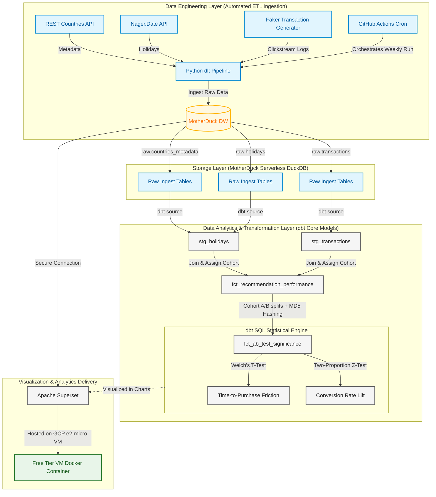

# 🛒 Indonesian Recommendation Friction Lab

An end-to-end automated A/B testing pipeline designed to measure the impact of context-aware (Geographical + Cultural) recommendations on user conversion in the Indonesian e-commerce market.

## 🎯 Project Overview
This project simulates an e-commerce recommendation engine to test the hypothesis: **"Does injecting local Indonesian context (holidays, regional trends) into product recommendations reduce purchase friction?"**

This repository serves as a portfolio piece demonstrating:
* **DE Skills:** Automated ELT pipelines, state management, and cloud orchestration.
* **DA Skills:** Statistical hypothesis testing, A/B experimental design, and actionable metric modeling.

## 🏗️ Architecture & Data Flow
The pipeline is designed to be fully automated and cloud-native:

1.  **Ingestion:** Python `dlt` pipeline pulls data from REST Countries API, Nager.Date API, and synthetic transaction logs.
2.  **Orchestration:** GitHub Actions triggers the pipeline weekly.
3.  **Storage:** MotherDuck (Serverless DuckDB) handles the data warehouse.
4.  **Transformation:** `dbt Core` models clean the data, assign user cohorts using MD5 hashing, and compute statistical significance (Welch's T-test and Z-test) directly in SQL.
5.  **Visualization:** Apache Superset (hosted on GCP e2-micro VM) connects securely to MotherDuck to display conversion rates and time-to-purchase lifts.

## 🛠️ Tech Stack
| Layer | Technology |
| :--- | :--- |
| **Compute/Cloud** | GCP (e2-micro) |
| **Orchestration** | GitHub Actions |
| **Ingestion** | Python (`dlt`) |
| **Data Warehouse** | MotherDuck |
| **Transformation** | `dbt Core` |
| **Visualization** | Apache Superset |

## 📊 A/B Testing Methodology
The experiment uses a randomized control trial split:
* **Control Group:** Generic, non-contextual recommendations.
* **Treatment Group:** Context-aware recommendations (triggered by holiday/geo-trends).
* **Metrics:** 
    * Primary: Conversion Rate (CVR).
    * Secondary: Time-to-Purchase (TTP) — our primary proxy for "Friction."
    * Significance Testing: Welch's T-Test and Chi-Squared implementation.

## 🚀 Getting Started
1. Clone the repo.
2. Set up your `.env` with `MOTHERDUCK_TOKEN`.
3. Run the pipeline: `python pipeline.py`.
4. Spin up the Superset container: `docker-compose up -d`.

---
*Built for the Indonesian Market | Powered by [GCP Free Tier]*
